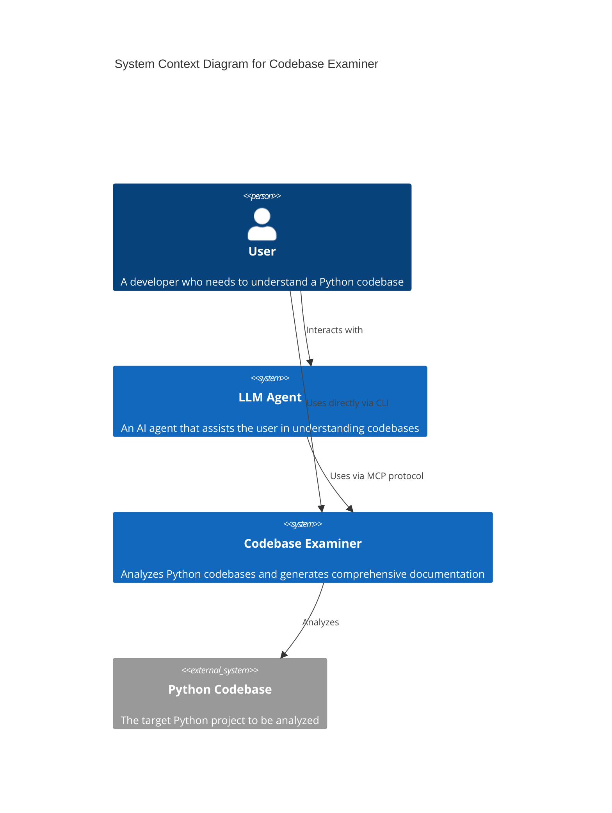
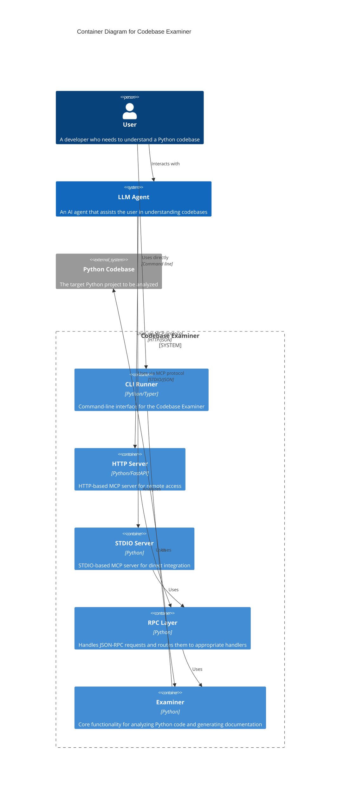

# Codebase Examiner

A command-line tool that examines Python codebases and generates comprehensive documentation about modules, classes, and functions. It can be run as a standalone CLI tool or as an HTTP/STDIO MCP server to provide this service to GenAI agents.

## Features

- Find all Python files in a project directory tree
- Automatically detect and respect pytest.ini configuration for test file organization
- Support different test layout strategies (separate tests directory or tests alongside implementation)
- Extract documentation from modules, classes, and functions
- Parse Google-style docstrings for parameter and return value documentation
- Generate documentation in Markdown or JSON format
- Run as an HTTP or STDIO-based server to retrieve documentation programmatically

## Installation

### Using pipx (Recommended)

```bash
pipx install codebase-examiner
```

### From Source

Clone the repository and install in development mode:

```bash
git clone https://github.com/username/codebase-examiner.git
cd codebase-examiner
pip install -e .
```

## Usage

### CLI Tool

Examine the current directory:

```bash
codebase-examiner examine
```

Examine a specific directory:

```bash
codebase-examiner examine --directory /path/to/project
```

Generate documentation in JSON format:

```bash
codebase-examiner examine --format json
```

Save documentation to a file:

```bash
codebase-examiner examine --output docs/codebase.md
```

Exclude additional directories:

```bash
codebase-examiner examine --exclude .venv --exclude tests --exclude docs
```

Generate markdown with only specific sections (e.g., title and modules):

```bash
codebase-examiner examine --section title --section modules
```

### HTTP Server

Start the HTTP server:

```bash
codebase-examiner serve --port 8080
```

Send a JSON-RPC request to `/jsonrpc`:

```bash
curl -X POST http://localhost:8080/jsonrpc \
     -H "Content-Type: application/json" \
     -d '{
       "jsonrpc": "2.0",
       "id": "1",
       "method": "tools/call",
       "params": {
         "name": "examine",
         "arguments": {
           "directory": ".",
           "exclude_dirs": [".venv"],
           "format": "markdown",
           "include_dotfiles": false
         }
       }
     }'
```

Response:

```json
{
  "jsonrpc": "2.0",
  "id": "1",
  "result": {
    "status": "success",
    "documentation": "# Codebase Documentation...",
    "modules_found": 5
  }
}
```


### STDIO Server

Start the STDIO server:

```bash
codebase-examiner-stdio
```

Send JSON-RPC commands to stdin and read JSON-RPC responses on stdout. For example:

```json
{ "jsonrpc": "2.0", "id": "1", "method": "tools/call", "params": { "name": "examine", "arguments": { "directory": ".", "exclude_dirs": [".venv"], "format": "markdown", "include_dotfiles": false } } }
```

```json
{ "jsonrpc": "2.0", "id": "1", "result": { "status": "success", "documentation": "# Codebase Documentation...", "modules_found": 5 } }
```

```json
{ "jsonrpc": "2.0", "id": "2", "method": "initialize", "params": {} }
```

```json
{ "jsonrpc": "2.0", "id": "2", "result": { "serverInfo": { "name": "Codebase Examiner", "version": "1.0.0" }, "capabilities": { "examineProvider": true }, "protocolVersion": null } }
```

```json
{ "jsonrpc": "2.0", "id": "3", "method": "exit", "params": {} }
```

```json
{ "jsonrpc": "2.0", "id": "3", "result": null }
```

Legacy command-based format is still supported for backward compatibility:

```json
{ "command": "examine", "directory": ".", "exclude_dirs": [".venv"], "format": "markdown", "include_dotfiles": false }
```

```json
{ "status": "success", "documentation": "# Codebase Documentation...", "modules_found": 5 }
```

## API Endpoints

When running as an HTTP server:

- `/jsonrpc` - JSON-RPC 2.0 endpoint for all operations

## Development

### Setup Development Environment

```bash
pip install -e ".[dev]"
```

### Running Tests

```bash
pytest
```

### Project Structure

- `src/codebase_examiner/core/` - Core functionality  
  - `file_finder.py` - Finding Python files  
  - `code_inspector.py` - Extracting documentation from code  
  - `doc_generator.py` - Generating documentation output  
- `src/codebase_examiner/cli.py` - Command-line interface  
- `src/codebase_examiner/mcp.py` - HTTP server implementation  
- `src/codebase_examiner/mcp_stdio.py` - STDIO server implementation  
- `tests/` - Test suite

### Architecture

The Codebase Examiner is built with a layered architecture that separates concerns and allows for multiple interfaces to the core functionality.

#### C4 Model Diagrams

##### Context Diagram (Level 1)



##### Container Diagram (Level 2)



##### Component Diagram (Level 3)


## License

MIT
