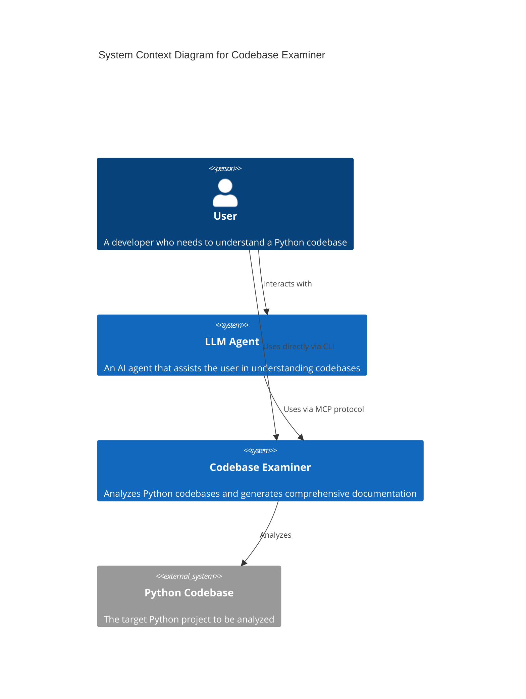
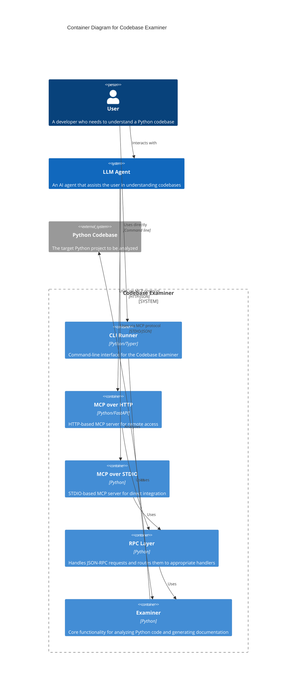
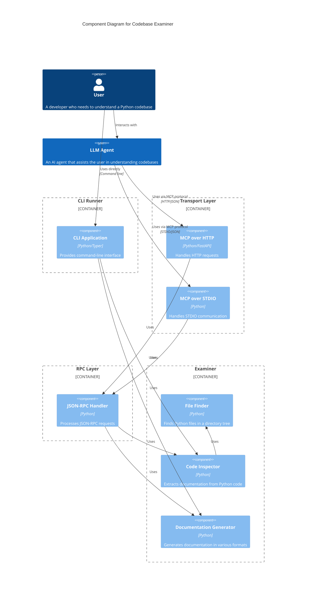

# Codebase Examiner

A powerful tool that analyzes Python codebases and generates comprehensive documentation about modules, classes, and functions. Designed to help both developers and AI agents understand large codebases despite context window limitations, it provides structured, information-dense summaries optimized for efficient navigation and comprehension.

## Overview

Codebase Examiner addresses a critical challenge in AI-powered coding: the inability of Large Language Models to process entire codebases due to context window limitations. By extracting essential structure and documentation from codebases and presenting it in an optimized format, the tool enables:

- **Efficient Navigation**: Quickly locate relevant code sections
- **Comprehensive Understanding**: Grasp system architecture and interdependencies
- **Optimized Token Usage**: Consume less context window space with structured summaries
- **Better Integration**: Understand how components interact within the system

The tool can be used as a standalone CLI application or integrated with AI systems through MCP (Machine Communication Protocol) over HTTP or STDIO.

## Features

- Find all Python files in a project directory tree
- Automatically detect and respect pytest.ini configuration for test file organization
- Support different test layout strategies (separate tests directory or tests alongside implementation)
- Extract documentation from modules, classes, and functions
- Parse Google-style docstrings for parameter and return value documentation
- Generate documentation in Markdown or JSON format
- Run as MCP over HTTP or MCP over STDIO to retrieve documentation programmatically

## Modular Architecture

Codebase Examiner has been redesigned with a modular, extensible architecture that includes:

- **Pluggable Extractors**: Specialized components for different types of code analysis
- **Extractor Registry**: Central system for managing and discovering extractors
- **Capability-Based Design**: Extractors declare their capabilities (CODE_STRUCTURE, DOCUMENTATION, etc.)
- **Unified Data Models**: Standardized structures for representing extracted information
- **Flexible Output**: Multiple renderer options for different documentation formats

## Documentation

For comprehensive documentation, visit the [Codebase Examiner Documentation Site](http://vetzal.com/codebase-examiner/).

## Installation

### Using pipx (Recommended)

```bash
pipx install codebase-examiner
```

### From Source

Clone the repository and install in development mode:

```bash
git clone https://github.com/username/codebase-examiner.git
cd codebase-examiner
pip install -e .
```

## Usage

### CLI Tool

Examine the current directory:

```bash
codebase-examiner examine
```

Examine a specific directory:

```bash
codebase-examiner examine --directory /path/to/project
```

Generate documentation in JSON format:

```bash
codebase-examiner examine --format json
```

Save documentation to a file:

```bash
codebase-examiner examine --output docs/codebase.md
```

Exclude additional directories:

```bash
codebase-examiner examine --exclude .venv --exclude tests --exclude docs
```

Generate markdown with only specific sections (e.g., title and modules):

```bash
codebase-examiner examine --section title --section modules
```

Specify which extractors to use:

```bash
codebase-examiner examine --extractors python_extractor
```

Filter by capability type:

```bash
codebase-examiner examine --capabilities CODE_STRUCTURE --capabilities DOCUMENTATION
```

List available extractors:

```bash
codebase-examiner list-extractors
```

### MCP over HTTP

Start the MCP over HTTP server:

```bash
codebase-examiner serve --port 8080
```

Send a JSON-RPC request to `/jsonrpc`:

```bash
curl -X POST http://localhost:8080/jsonrpc \
     -H "Content-Type: application/json" \
     -d '{
       "jsonrpc": "2.0",
       "id": "1",
       "method": "tools/call",
       "params": {
         "name": "examine",
         "arguments": {
           "directory": ".",
           "exclude_dirs": [".venv"],
           "format": "markdown",
           "include_dotfiles": false
         }
       }
     }'
```

Response:

```json
{
  "jsonrpc": "2.0",
  "id": "1",
  "result": {
    "status": "success",
    "documentation": "# Codebase Documentation...",
    "modules_found": 5
  }
}
```


### MCP over STDIO

Start the MCP over STDIO server:

```bash
codebase-examiner-stdio
```

Send JSON-RPC commands to stdin and read JSON-RPC responses on stdout. For example:

```json
{ "jsonrpc": "2.0", "id": "1", "method": "tools/call", "params": { "name": "examine", "arguments": { "directory": ".", "exclude_dirs": [".venv"], "format": "markdown", "include_dotfiles": false } } }
```

```json
{ "jsonrpc": "2.0", "id": "1", "result": { "status": "success", "documentation": "# Codebase Documentation...", "modules_found": 5 } }
```

```json
{ "jsonrpc": "2.0", "id": "2", "method": "initialize", "params": {} }
```

```json
{ "jsonrpc": "2.0", "id": "2", "result": { "serverInfo": { "name": "Codebase Examiner", "version": "1.0.0" }, "capabilities": { "examineProvider": true }, "protocolVersion": null } }
```

```json
{ "jsonrpc": "2.0", "id": "3", "method": "exit", "params": {} }
```

```json
{ "jsonrpc": "2.0", "id": "3", "result": null }
```

Legacy command-based format is still supported for backward compatibility:

```json
{ "command": "examine", "directory": ".", "exclude_dirs": [".venv"], "format": "markdown", "include_dotfiles": false }
```

```json
{ "status": "success", "documentation": "# Codebase Documentation...", "modules_found": 5 }
```

## API Endpoints

When running as an MCP over HTTP server:

- `/jsonrpc` - JSON-RPC 2.0 endpoint for all operations

## Development

### Setup Development Environment

```bash
pip install -e ".[dev]"
```

### Running Tests

```bash
pytest
```

### Project Structure

- `src/codebase_examiner/core/` - Core functionality  
  - `file_finder.py` - Finding Python files  
  - `code_inspector.py` - Orchestrating code analysis  
  - `doc_generator.py` - Generating documentation output
  - `registry.py` - Extractor registry system
  - `models.py` - Data models for extracted information
  - `extractors/` - Pluggable code extractors
    - `base.py` - Base extractor interface
    - `python_extractor.py` - Python-specific extraction
  - `renderers/` - Output formatters
    - `base.py` - Renderer interface
    - `markdown_renderer.py` - Markdown output
    - `json_renderer.py` - JSON output
  - `section_generators.py` - Documentation section generators
- `src/codebase_examiner/cli.py` - Command-line interface  
- `src/codebase_examiner/mcp.py` - MCP over HTTP implementation
- `src/codebase_examiner/mcp_stdio.py` - MCP over STDIO implementation
- `tests/` - Test suite

### Extending with Custom Extractors

The modular architecture allows you to create custom extractors for specific analysis needs or additional programming languages. To create a custom extractor:

1. **Create a new class** that inherits from `BaseExtractor`
2. **Implement required methods**:
   - `can_extract(file_path)`: Determine if the extractor can handle a given file
   - `extract(file_path)`: Perform the extraction and return structured data
   - `get_capabilities()`: Declare what types of analysis the extractor provides
3. **Register your extractor** with the registry:

```python
from codebase_examiner.core.registry import ExtractorRegistry
from my_custom_extractors import MyCustomExtractor

# Register your extractor
ExtractorRegistry.get_instance().register_extractor(MyCustomExtractor())
```

Extractors can provide various capabilities:
- `CODE_STRUCTURE`: Classes, functions, modules
- `DEPENDENCIES`: Import analysis, dependency graphs
- `METRICS`: Lines of code, complexity, test coverage
- `SECURITY`: Vulnerability scanning, code quality
- `DOCUMENTATION`: Docstring analysis, comment extraction
- `STYLE`: Code formatting, linting issues

### Architecture

The Codebase Examiner is built with a layered architecture that separates concerns and allows for multiple interfaces to the core functionality.

#### C4 Model Diagrams

##### Context Diagram (Level 1)



##### Container Diagram (Level 2)



##### Component Diagram (Level 3)



## License

MIT
