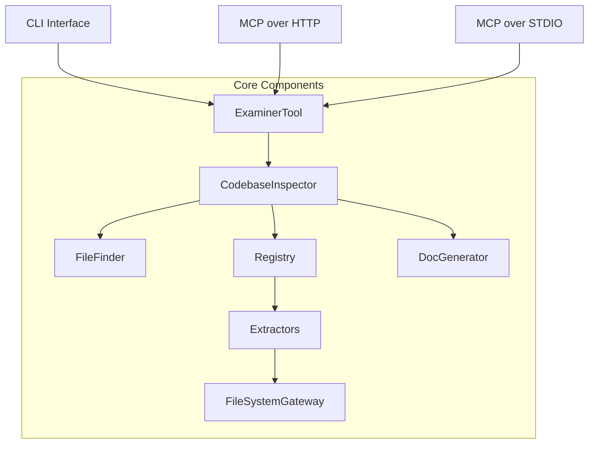
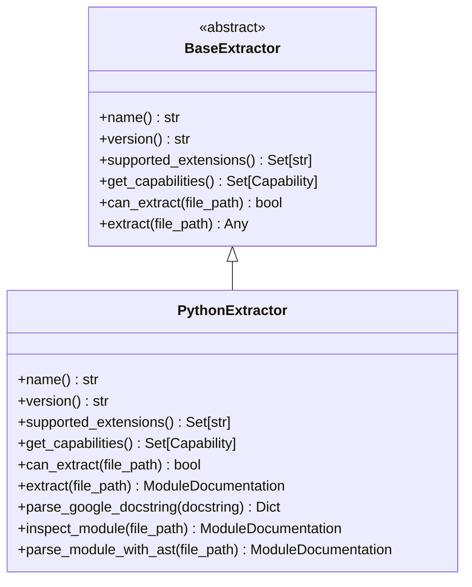
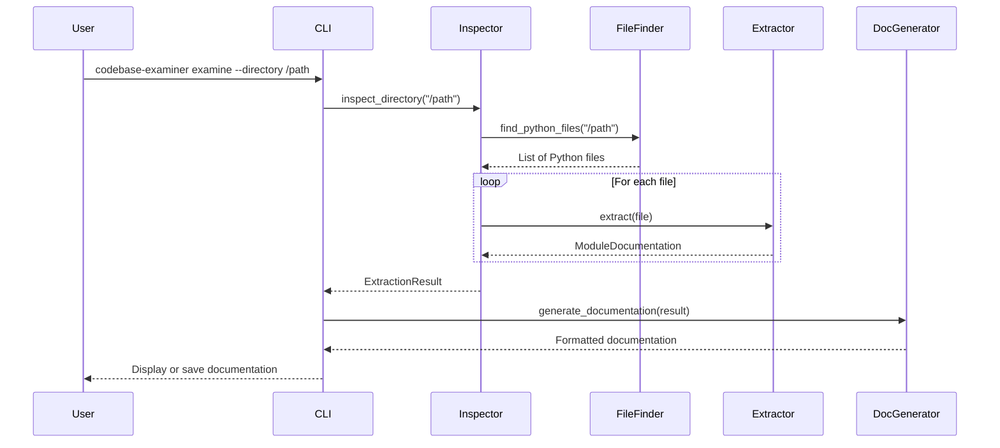

# Codebase Examiner Architecture

This document describes the architecture of the Codebase Examiner tool, explaining how the different components work together to analyze Python codebases and generate documentation.

## System Overview

Codebase Examiner is designed with a modular architecture that separates concerns and allows for extensibility. The system can be used as a command-line tool, MCP over HTTP, or MCP over STDIO.

## Component Descriptions

### User Interfaces

The tool provides three main interfaces:

1. **CLI Interface**: Command-line interface for direct use
2. **MCP over HTTP**: MCP server over HTTP for integration with other tools
3. **MCP over STDIO**: MCP server over standard input/output for integration with other tools

### Core Components

#### ExaminerTool

The `ExaminerTool` class is the main entry point for the MCP server interfaces. It implements the `LLMTool` interface and provides the `examine_codebase` function that can be called by LLMs through the MCP protocol.

#### CodebaseInspector

The `CodebaseInspector` class orchestrates the inspection process. It:
- Uses the `FileFinder` to locate Python files
- Gets appropriate extractors from the `Registry`
- Applies extractors to each file
- Collects the results into an `ExtractionResult`

#### FileFinder

The `FileFinder` module is responsible for finding Python files in a directory structure. It:
- Respects pytest.ini configuration for test files
- Can exclude specific directories and dotfiles
- Uses the `FileSystemGateway` for file operations

#### Registry

The `Registry` maintains a list of available extractors and provides methods to get appropriate extractors for a given file.

#### Extractors

Extractors are responsible for analyzing files of specific types and extracting structured information from them. The system currently includes:

- `PythonExtractor`: Extracts information from Python files using both runtime inspection and AST parsing

Each extractor implements the `BaseExtractor` interface and provides specific capabilities.

#### DocGenerator

The `DocGenerator` module is responsible for generating documentation from the extracted information. It supports:
- Markdown format with customizable sections
- JSON format for machine-readable output

#### FileSystemGateway

The `FileSystemGateway` provides an abstraction layer for file system operations, making it easier to test the system and potentially support different file sources in the future.

## Data Flow

The following diagram illustrates the data flow through the system:

## Extension Points

The architecture is designed to be extensible in several ways:

1. **New Extractors**: Add support for new file types by implementing the `BaseExtractor` interface
2. **New Capabilities**: Extend existing extractors with new capabilities (e.g., metrics, security analysis)
3. **New Section Generators**: Create custom documentation sections by implementing the `SectionGenerator` interface
4. **New Output Formats**: Add support for new output formats beyond Markdown and JSON

## Configuration

The system can be configured through:
- Command-line arguments
- Project-specific configuration (e.g., pytest.ini for test file patterns)
- Environment variables (for future use)

## Error Handling

The system includes error handling at multiple levels:
- File-level errors are caught and reported, allowing the process to continue with other files
- Command-level errors are caught and reported with appropriate exit codes
- MCP server errors are reported according to the MCP protocol
